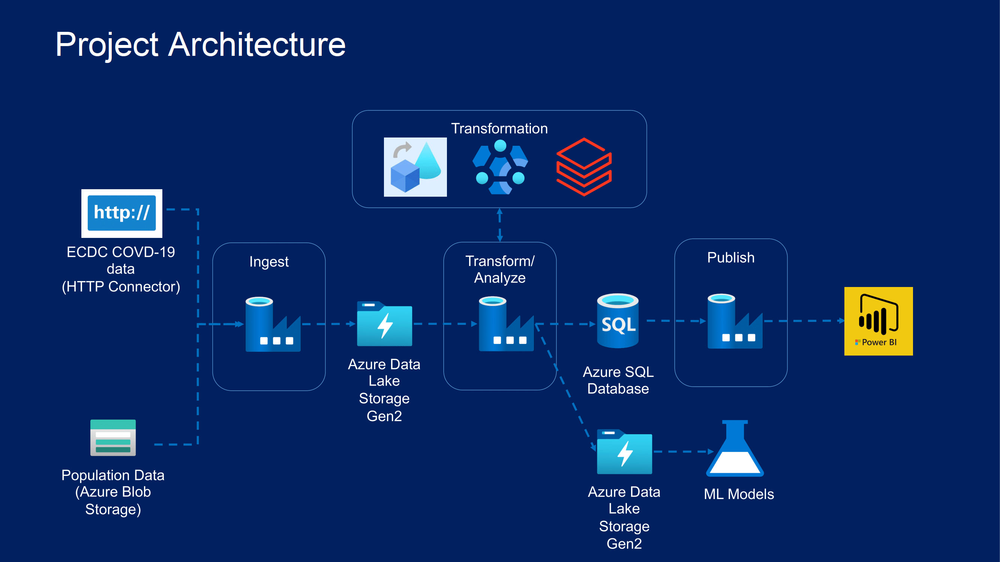
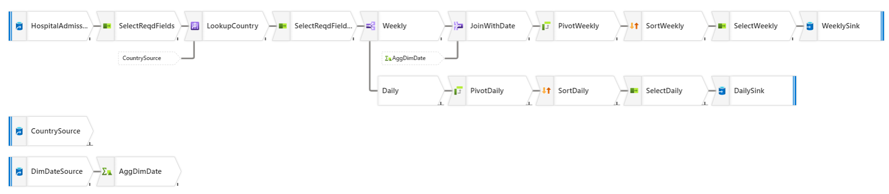
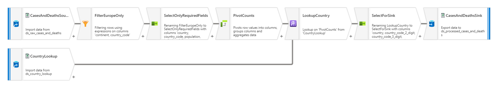

## Project Introduction:
Microsoft Azure data engineering project on COVID-19 data from 2 different sources. Loaded the dataset with the help of Azure Data Factory linked services and then performed transformations by using ADF, HDInsight and Databricks. When the data was processed, then it was loaded into Azure SQL database for analysis generating reports. All of these objectives were achieved by using ADF pipelines and event based triggers to automate the workflows.

## Project Architecture Diagram:

## Technologies Used:
i- Azure Data Factory\
ii- Azure HDInsight\
iii- Azure Databricks\
iv- ADLS Gen 2 storage\
v- Azure SQL Database\
vi- PowerBI Desktop

## Project Stages:
### 1- Data Ingestion
Ingested data from 2 different sources. First source was Azure Datalake gen 2 storage and second source was ECDC website. The dataset from ECDC is loaded by using HTTP connector of Data Factory. Total 4 files are ingested to be processed in next stage.
### 2- Data Transformation
Data is processed and transformed by using 3 different Azure services:\
i- Azure Data Factory transformations\
ii- Azure HDInsight\
iii- Azure Databricks\
The reason for using these 3 different platforms was that to explore each service and understand its potential. The snapshot of ADF transformations workflow is as follows:\
#### Hospitals Admissions Transformation

#### Cases and Deaths Transformation

### 3- Data Publishing
After the data was transformed and ready to be used by data scientists, it was published on Azure SQL database using ADF pipelines. This data was later used for generating PowerBI reports. 

## Project Outcomes:
This project allowed me to demonstrate my expertise in Azure technologies, particularly in using Azure Databricks and Data Factory to orchestrate complex data workflows. It highlights the power of Azure Databricks and Data Factory in automating the process of cleaning and storing data, which in turn saves a lot of time and effort. I am excited about the endless possibilities that Microsoft Azure offers and can't wait to explore more. If you're interested in learning more about this project or collaborating on similar projects, feel free to reach out to me!
